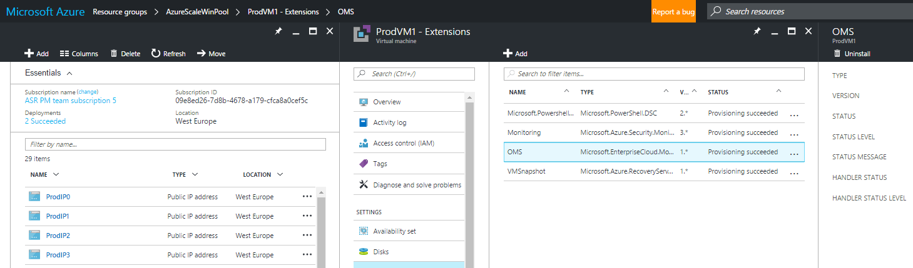
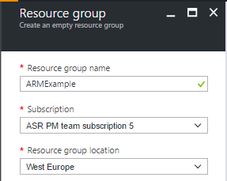
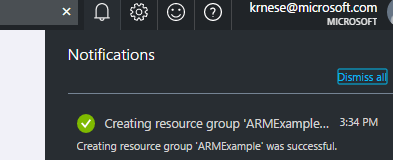
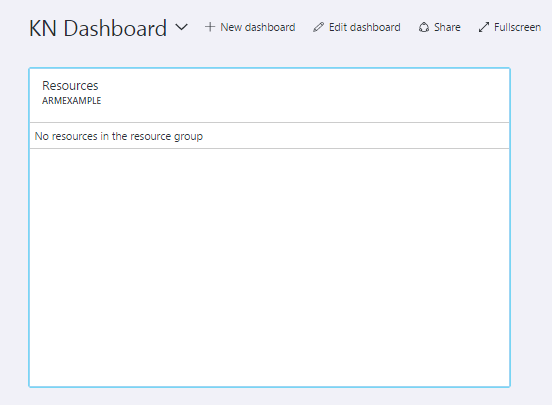

# Azure Resource Manager Inside-Out

>This training material is developed by Hybrid CAT, with the intention to onboard customers and the community to Azure Resource Manager template authoring and management, targeting both Azure and Azure Stack
>

>For questions or feedback, contact **krnese@microsoft.com**

### Before you begin

The objective of this training is to learn how to author templates, interact with Azure Resource Manager through its API, Visual Studio (Visual Studio Code), Azure portal, source code systems (GitHub, TFS), and PowerShell. 

To complete these labs, you need to ensure you have access to the following tools:

* Admin access to an Azure subscription (minumum trial subscription)
* Visual Studio or Visual Studio Code with the Azure SDK/ARM extension installed
* Azure PowerShell module

## Lab 1 - Azure portal and Azure PowerShell 

During this excercise, you will become familiar with the Azure portal and explore its management capabilities, and customize the settings to fit your needs

#### 1.1 Exploring Azure using the portal

1. From your computer, use your preferred browser and navigate to [Azure portal](https://azure.portal.com)
2. Sign in with your credentials that has acess to an Azure subscription (Admin access is required to complete the labs)
3. When logged in, explore the options you have available in the portal and familiarize yourself with the structure. Verify that by drilling further in for each object you selects, which should open new blades

4. Close all the open blades and proceed to part 2.

#### 1.2 Create Resource Group using Azure portal

1. In the portal, click on *New*,search for *Resource Group*, and click *Create*
2.  Assign a name for the resource group, the location that will store the metadata and click *Create*

3. Notice that you get a notification in the upper right once the deployment has completed. This is where you can track your deployments, so you can see if they are completed successfully, or are failing

#### 1.3 Customizing the Azure portal

1. In the Azure portal on the main page, click on **+New dashboard**, assign a name and click **Done customizing**

2. Next, navigate to the resource group you created earlier by clicking on **More services**, **Resource groups**, and click on it. 
3. In the upper right of the resource group blade, you should see a pin which let you pin this particular resource to the dashboard you just created. Click on **Pin to dashboard** and go back to the main your dashboard

#### 4 - Exploring Azure using PowerShell

1. Log on to Azure using PowerShell with the following cmdlet

		Add-AzureRmAccount 

You will be prompted for the credentials and be routed to your default subscription when logged in.

2. To get a list of all subscriptions you have access to, run the following cmdlet

		Get-AzureRmSubscription

3. Select the preferred subscription using this cmdlet

		Select-AzureRmSubscription -subscriptionId [the subscription id of the subscription]

4. You can always verify the subscription you are logged into by executing

		Get-AzureRmContext

5. Ensure you are logged into the subscription where you have created the resource group, and retrieve the resource group using the following cmdlet

		Get-AzureRmResourceGroup -Name [name of your resource group]

6. Create a new resource group using PowerShell with this cmdlet

		New-AzureRmResourceGroup -Name [name of the resource group] -Location [your preferred location, like "West Europe", East US" etc]

You have now completed the basics in **lab 1**, by familiarizing yourself with the Azure portal and Azure PowerShell module, which will be essential as you proceed with the labs

## Lab 2 - Getting started with ARM templates

In this lab, you will learn the basics of Resource Manager templates, and create a reusable template

#### Creating a resource manager template for storage accounts

1. Start by creating a resource manager template that will create a storage account. Open your preferred JSON editor (Visual Studio or Visual Studio Code), and create a template similar to the example below

		{
    	"$schema": "http://schema.management.azure.com/schemas/2015-01-01/deploymentTemplate.json#",
    	"contentVersion": "1.0.0.0",
    	"resources": [
        	{
        	    "apiVersion": "2015-05-01-preview",
        	    "type": "Microsoft.Storage/storageAccounts",
        	    "name": "myfirststorage01",
        	    "location": "East US",
        	    "tags": {
        	    },
        	    "properties":{
        	        "accountType": "Standard_LRS"
        	    }
        	}
    	],
    	"outputs": {
    		}
		}

2. Save the template to a folder on your machine and try to do a deployment using PowerShell with the following cmdlets

		New-AzureRmResourceGroupDeployment -Name storageTest `
										   -ResourceGroupname <name of your existing resource group> `
										   -TemplateFile <directory where you saved your .json file> `
										   -Verbose

Did the template succeed? If no, why not? What was the error?

#### Adding parameters

3. The template was designed to be static with hard coded values for each property. A storage account in Azure has to have a unique name, which cause the deployment to fail. To mitigate this, we will add two parameters to the template, so the user can determine the storage account name and the location of it. Add two parameters to the template as shown below, and reflect these parameters in the resource section

		{
	    "$schema": "http://schema.management.azure.com/schemas/2015-01-01/deploymentTemplate.json#",
	    "contentVersion": "1.0.0.0",
	    "parameters": {
	        "storageName": {
	            "type": "string"            
	        },
	        "location": {
	            "type": "string"
	        }
	    },
	    "resources": [
	        {
	            "apiVersion": "2015-05-01-preview",
	            "type": "Microsoft.Storage/storageAccounts",
	            "name": "[parameters('storageName')]",
	            "location": "[parameters('location')]",
	            "tags": {
	            },
	            "properties":{
	                "accountType": "Standard_LRS"
	            }
	        }
	     ],
	    "outputs": {	        
	    	}
	    }

4. Save the template to a folder on your machine, and try to do a new deployment using PowerShell

		New-AzureRmResourceGroupDeployment -Name storageTest `
                                  		   -ResourceGroupname <name of your existing resource group> `
                                   		   -TemplateFile <directory where you saved your .json file> `
										   -storageName <a name for your storage account>
										   -location <your preferred location>
                                           -Verbose

Did the deployment succeed? If not, what was the error?

#### Adding variables

5. Since storage account names need to be unique, it is risky to 'guess' a name for your deployment and risk that the entire deployment will fail just because of that.
This is where we can take advantage of variables in the ARM template, which represent values that will help to simplify the language and expressions used in the template, and also contains values and settings we don't want to expose to the user who need to deploy this template.
To guarantee that the storage will successfully deploy now, we will add the following variable to the template and use the **uniqueString** function to generate - a unique name for the storage account.
Follow the example below to add a uniqueString to the variables section, and remove the parameter for storageName

		{
		    "$schema": "http://schema.management.azure.com/schemas/2015-01-01/deploymentTemplate.json#",
		    "contentVersion": "1.0.0.0",
		    "parameters": {
		        "location": {
		            "type": "string"
		        }
		    },
		    "variables": {
		        "storageName": "[uniqueString('storage')]"
		    },
		    "resources": [
		        {
		            "apiVersion": "2015-05-01-preview",
		            "type": "Microsoft.Storage/storageAccounts",
		            "name": "[variables('storageName')]",
		            "location": "[parameters('location')]",
		            "tags": {
		            },
		            "properties":{
		                "accountType": "Standard_LRS"
		            }
		        }
		    ],
		    "outputs": {		        
		    }
		}

6. Save the template to a directory on your machine, and do a new deployment using PowerShell similar to this:

		New-AzureRmResourceGroupDeployment -Name storageTest `
		                                   -ResourceGroupName <name of your existing resource group> `
		                                   -TemplateFile <path to your json file> `
		                                   -location <your preferred location> `
		                                   -Verbose

#### Adding Outputs

1. Templates can also provide outputs, which can be useful in case you need to retrieve information from resources in other resource groups, or from resources in the deployment itself. We will here use the **reference** function to retrieve a particular value from the storage account in the output section. Create a template similar to the example below

		{
		    "$schema": "http://schema.management.azure.com/schemas/2015-01-01/deploymentTemplate.json#",
		    "contentVersion": "1.0.0.0",
		    "parameters": {
		        "location": {
		            "type": "string"
		        }
		    },
		    "variables": {
		        "storageName": "[uniqueString('storage')]"
		    },
		    "resources": [
		        {
		            "apiVersion": "2015-05-01-preview",
		            "type": "Microsoft.Storage/storageAccounts",
		            "name": "[variables('storageName')]",
		            "location": "[parameters('location')]",
		            "tags": {
		            },
		            "properties":{
		                "accountType": "Standard_LRS"
		            }
		        }
		    ],
		    "outputs": {
		        "fqdn": {
		            "type": "string",
		            "value": "[reference(resourceId('Microsoft.Storage/storageAccounts/', variables('storageName')), '2015-05-01-preview').primaryEndpoints.blob]"
		        }
		    }
		}

2. Save the template to a directory on your machine, and do a new deployment using PowerShell similar to this:

		New-AzureRmResourceGroupDeployment -Name storageTest `
		                                   -ResourceGroupName <name of your existing resource group> `
		                                   -TemplateFile <path to your json file> `
		                                   -location <your preferred location> `
		                                   -Verbose

Verify that the template successfully deployed. If you didn't change the deployment name, you should not end up with another storage account since ARM and the resources are idempotent. Verify that you got the expected output.

		DeploymentName          : storageTest
		ResourceGroupName       : ARMExample
		ProvisioningState       : Succeeded
		Timestamp               : 1/11/2017 8:03:39 PM
		Mode                    : Incremental
		TemplateLink            : 
		Parameters              : 
		                          Name             Type                       Value     
		                          ===============  =========================  ==========
		                          location         String                     westeurope
		                          
		Outputs                 : 
		                          Name             Type                       Value     
		                          ===============  =========================  ==========
		                          fqdn             String                     https://zu4ll3n7x3ok6.blob.core.windows.net/
		                          
		DeploymentDebugLogLevel : 

#### Deploy multiple resources using copyIndex()

1. You can deploy the same resource type multiple times by using the numeric **copyIndex** function. For the resource you want to create multiple times, you must define a **copy** object that specifies the number of times to iterate. Create a new template similar to the example below

		{
		    "$schema": "http://schema.management.azure.com/schemas/2015-01-01/deploymentTemplate.json#",
		    "contentVersion": "1.0.0.0",
		    "parameters": {
		        "location": {
		            "type": "string"
		        },
		        "count": {
		            "type": "int"
		        }
		    },
		    "variables": {
		        "storageName": "[toLower(concat(parameters('count'), deployment().name, uniqueString('s')))]"
		    },
		    "resources": [
		        {
		            "apiVersion": "2015-05-01-preview",
		            "type": "Microsoft.Storage/storageAccounts",
		            "name": "[concat(variables('storageName'), copyIndex())]",
		            "location": "[parameters('location')]",
		            "tags": {},
		            "copy": {
		                "name": "[concat(variables('storageName'), 'blob')]",
		                "count": "[parameters('count')]"
		            },
		            "properties": {
		                "accountType": "Standard_LRS"
		            }
		        }
		    ],
		    "outputs": {
		    }
		}

2. Save the template to a directory on your machine, and do a new deployment using PowerShell similar to this:

		New-AzureRmResourceGroupDeployment -Name storageTest `
		                                   -ResourceGroupName <name of your existing resource group> `
		                                   -TemplateFile <path to your json file> `
		                                   -location <your preferred location> `
		                                   -Verbose