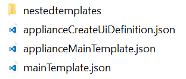
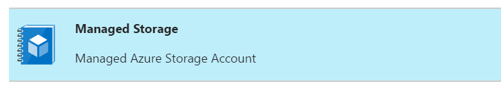

# Lab 8 - Azure Managed Application

>Last updated: 6/20/2017

>Author: krnese

### Azure Resource Manager - Demystified

>For questions or feedback, contact **krnese@microsoft.com**

### Before you begin

The objective of this training is to learn how to author templates, interact with Azure Resource Manager through its API, Visual Studio (Visual Studio Code), Azure portal, source code systems (GitHub, TFS), and PowerShell. 

To complete these labs, you need to ensure you have access to the following tools:

* Admin access to an Azure subscription (minumum trial subscription)
* Visual Studio or Visual Studio Code with the Azure SDK/ARM extension installed
* Azure PowerShell module

### Lab 8 - Azure Managed Application

### Objectives

Learn how to build and publish an Azure Managed Applications to your company's internal Service Catalog, to enable self-service of approved applications, while separating the consumer and management aspect. 

**Scenario**

Your company recently had an incident, when someone accidentally changed the configuration of a storage account in Azure, being used by a LOB application. Your CIO was quite upset, realizing the app went south - stating that "my devs know all about code, but nothing about the operational aspect of the environment it executes in". For your company to be even more successful with Azure, he wants you to start building templates for all the approved Azure services you are using. Further, he wants you to initialize a Service Catalog with Managed Applications for these offerings, and make them available to the developers.

He list the following requirements:

* Approved Azure services for production should be templatized, centralized and managed by the SMEs
* The business units and devs should only be able to *consume* the service - and have *read only* access to the underlying Azure resources, to avoid that anything can be deleted or changed by accident (again)
* It's important that the devs can deploy what they need, through self-service, without adding any enterprise IT tax on top
* The top priority right now, is to start with a storage account, to replace the storage that caused the application to fail
* He wants you to prepare for a design that is scalable, and can be reused for other Managed Applications using nested templates
* the API version for each resource, must be using the latest version available
* The UI in the Azure portal for deploying, must be easy to understand and eliminate any possible human error

#### Creating the managed storage account template

Before you start to build the Resource Manager template for storage accounts, you need to determine the latest API version available.

Use the following PowerShell cmdlet to explore what's the latest:

	((Get-AzureRmResourceProvider -ProviderNamespace Microsoft.Storage).ResourceTypes | Where-Object ResourceTypeName -EQ storageAccounts).ApiVersions

Go ahead and create the template from scratch, ensuring you include the following:

* Parameter for storageAccountName
* Parameter for storageAccountType
* The resource location should be set to [resourceGroup().location]
* Output referencing the endpoint of the storage blob

When done, save the template as *storageAccount.json*

#### Creating the appliance main template

From scratch, build a appliance main template that will deploy the newly created storage account template, as a nested template deployment

The requirements for this template is to have:

* Parameters that maps towards the parameters in the nested (storage account) template
* A variable that points to the nested template, using the *uri()* function
* Output referencing the output from the nested template

When done, save the template as *applianceMainTemplate.json*

#### Creating the main template

The main template will be the template the developer will interact with from the portal, when deploying the Managed Application later. The construct of this template is a bit similar to the *applianceMainTemplate.json*, as it need to contain the same parameters, and those parameters must be embedded into the appliance resource declaration too.

Use the following PowerShell cmdlet to retrieve the latest API version for the appliance resource you will be using in this template:

	((Get-AzureRmResourceProvider -ProviderNamespace Microsoft.Solutions).ResourceTypes | Where-Object ResourceTypeName -EQ appliances).ApiVersions

Next, create the Resource Manager template similar to the one below, but ensure the parameters are matching what you have declared in your templates.

	{
	    "$schema": "https://schema.management.azure.com/schemas/2015-01-01/deploymentTemplate.json#",
	    "contentVersion": "1.0.0.0",
	    "parameters": {
	        "storageAccountName": {
	            "type": "string",	            
	        },
	        "storageAccountType": {
	            "type": "string"
	        }
	    },
	    "variables": {
	        "managedResourceGroup": "[concat(resourceGroup().id,uniquestring(resourceGroup().id))]"
	    },
	    "resources": [
	        {
	            "type": "Microsoft.Solutions/appliances",
	            "apiVersion": "2016-09-01-preview",
	            "name": "[parameters('storageAccountName')]",
	            "location": "[resourceGroup().location]",
	            "kind": "serviceCatalog",
	            "properties": {
	                "applianceDefinitionId": "/subscriptions/{yourSubscriptionId}/resourceGroups/{yourRgName}/providers/Microsoft.Solutions/applianceDefinitions/{yourDefinitionName}",
	                "managedResourceGroupId": "[variables('managedResourceGroup')]",
	                "parameters": {
	                    "storageAccountName": {
	                        "value": "[parameters('storageAccountName')]"
	                    },
	                    "storageAccountType": {
	                        "value": "[parameters('storageAccountType')]"
	                    }
	                }
	            }
	        }
	    ],
	    "outputs": {}
	}

Save the template as *mainTemplate.json* - and pay attention to the "applianceDefinitionId" property, which you will revisit and update later.

#### Create the appliance UI definition

In order for your devs to deploy this managed application successfully through the Service Catalog using the Azure portal, you need to build an UI definition which will generate the required outputs to the templates you just created.

Save the following template to disk, named as *applianceUiDefinition.json*

	{
	    "handler": "Microsoft.Compute.MultiVm",
	    "version": "0.1.2-preview",
	    "parameters": {
	        "basics": [
	            {}
	        ],
	        "steps": [
	            {
	                "name": "storageConfig",
	                "label": "Storage settings",
	                "subLabel": {
	                    "preValidation": "Configure the infrastructure settings",
	                    "postValidation": "Done"
	                },
	                "bladeTitle": "Storage settings",
	                "elements": [
	                    {
	                        "name": "storageAccounts",
	                        "type": "Microsoft.Storage.MultiStorageAccountCombo",
	                        "label": {
	                            "prefix": "Storage account name",
	                            "type": "Storage account type"
	                        },
	                        "defaultValue": {
	                            "type": "Standard_LRS"
	                        },
	                        "constraints": {
	                            "allowedTypes": [
	                                "Premium_LRS",
	                                "Standard_LRS",
	                                "Standard_GRS"
	                            ]
	                        }
	                    }
	                ]
	            }
	        ],
	        "outputs": {
	            "storageAccountName": "[steps('storageConfig').storageAccounts.prefix]",
	            "storageAccountType": "[steps('storageConfig').storageAccounts.type]"
	        }
	    }
	}

#### Creating the file and folder structure

Ensure all your files are located in the same folder, and the *storageAccount.json* template is in a subfolder called *nestedtemplates*, similar to the structure below.

#### Create Azure AD group for Central IT

You need to create an Azure AD group, where its members will have sufficient access to the underlying Azure resource(s) for the managed application. 

To achieve this, login to [Azure portal](https://portal.azure.com) and start the Cloud shell

Run the following Azure CLI cmdlets:

	az ad group create --display-name "CentralIt" --mail-nickname "centralitmgmt"

Now, you will need to retrieve the objectId of the group you just created, using the following Azure CLI cmdlet

	az ad group show –-group "CentralIt"

Once you have the objectId for the newly created AAD group, you need the objectId of the *Owner* role definition in Azure, which you will map to

	az role definition list --name Owner

Please note the id for both the AAD group and the Owner role definition

#### Creating a Resource Group in Azure to contain the appliance definition

Start by creating a new resource group in Azure, using Cloud shell with the following Azure CLI cmdlet:

	az group create --name MyAppliance --location westcentralus --verbose

Please note the *id* of the resource group, which you will use when updating the *applianceDefinitionId* property in your *mainTemplate.json* template.
Here's an example of the output: 
	
	"/subscriptions/09e8ed26-7d8b-4678-a179-cfca8a0cef5c/resourceGroups/MyAppliance"

#### Update *applianceDefinitionId* property in mainTemplate.json

Next, revisit the *mainTemplate.json* template to update the *applianceDefinitionId* property, to be:

	"applianceDefinitionId": "/subscriptions/{yourSubscriptionId}/resourceGroups/{yourRgName}/providers/Microsoft.Solutions/applianceDefinitions/{yourDefinitionName}"

Update the id to point to the newly created resource group, and use *managedStorage* as the name of your definition, similar to this, where you replace the subscription Id with your own:

	"/subscriptions/09e8ed26-7d8b-4678-a179-cfca8a0cef5c/resourceGroups/MyAppliance/providers/Microsoft.Solutions/applianceDefinitions/managedStorage"

#### Zip and upload the Managed Application to a storage account

Navigate to the folder containing all of your managed application files.

Select all, and send to a compressed (.zip) folder, name it *storage.zip*

Upload the zip to a blob storage in Azure - and note the uri!

#### Creating the Managed Application definition in Azure

In the [Azure portal](https://portal.azure.com), start the cloud shell and run the following Azure CLI cmdlet, but ensure you update the cmdlet to reflect your:

* --authorizations matches the AAD object Id + Role Definition Id in your environment - which are ids separated by ':'
* --package-file-uri points to your storage endpoint
* --l (location) is set to "westcentralus"

		az managedapp definition create -n managedStorage -l "westcentralus" --resource-group MyAppliance --lock-level ReadOnly --display-name "Managed Storage Account" --description "Managed Azure Storage Account"  --authorizations "688378e8-50b1-4970-ac7e-596bf061475c:8e3af657-a8ff-443c-a75c-2fe8c4bcb635" --package-file-uri "https://storageaccountname.blob.core.windows.net/mycontainer/storage.zip" --debug 

#### Deploy the Managed Application from the [Azure portal](https://portal.azure.com)

In the portal, navigate to *Managed applications*, click *add*, and you should see *Managed Storage*. 

Verify that you can perform a successful deployment, and ensure the resource group location is set to **West Central Us**

>Note:

>If the deployment failed, we encourage you to compare your templates with the following [sample](https://github.com/Azure/azure-managedapp-samples/tree/master/samples/101-storageAccount) from our Managed App repository, which was used as a baseline for this lab. It was by intention, that we didn't disclose this till the end of this lab :-)
