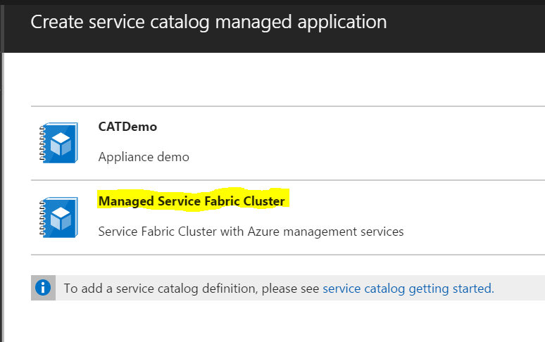

# Azure Managed Application
## Service Fabric Cluster, with option for Premium Management with OMS

### How to try out this Azure Managed Application

First, download all the files for this sample, to a folder on your machine.

* applianceMainTemplate.json

This is the ARM template that will deploy all the underlying Azure resources to the managed resource group, for the managed application

* mainTemplate.json

This is the template that the consumer will deploy, which will be mapped towards the applianceMainTemplate. This template will deploy the Managed Application (*appliance resource type*)

* applianceCreateUiDefinition.json

This us the UI definiton the consumer will interact with, when deploying the managed application from the service catalog in Azure

#### Step 1

You will need the object Id of your Azure Ad group, and the principal Id of the Azure role, which will be used to define the level of authorization towards the underlying Azure resources.

Here's an example from my environment, where I have the object id from a newly created AAD group, and the *Owner* principal Id in Azure:

	Object Id of the Azure Ad group: '2d7641f0-dbb7-4097-bb19-c098c8756086'
	Principal Id of the Owner: '8e3af657-a8ff-443c-a75c-2fe8c4bcb635'

#### Step 2

Create a new resource group where you will create the appliance definition a bit later

#### Step 3

If you haven't downloaded the files yet, now is a good time :-)
Open *mainTemplate.json* in your favorite JSON editor, and modify the following line to reflect your environment:

	"applianceDefinitionId": "/subscriptions/{yourSubscriptionId}/resourceGroups/{yourResourceGroupname}/providers/Microsoft.Solutions/applianceDefinitions/serviceFabricDef",

Save the changes

#### Step 4

Put all the three files into a zip-folder, and upload it to a storage account in Azure

#### Step 5

Create the managed application definition (in westcentralus) using Azure CLI (*PowerShell support will come shortly*). Below you can see an example:

	az managedapp definition create -n serviceFabricDef -l "westcentralus" --resource-group ApplianceDef --lock-level ReadOnly --display-name "Managed Service Fabric Cluster" --description "Service Fabric Cluster with Azure management services"  --authorizations "688378e8-50b1-4970-ac7e-596bf061475c:8e3af657-a8ff-443c-a75c-2fe8c4bcb635" --package-file-uri "https://catappliance.blob.core.windows.net/def/serviceFabricDef.zip" --debug

#### Step 6

Congratz! You should now be able to deploy this Managed Application (in westcentralus) from the Service Catalog in Azure

