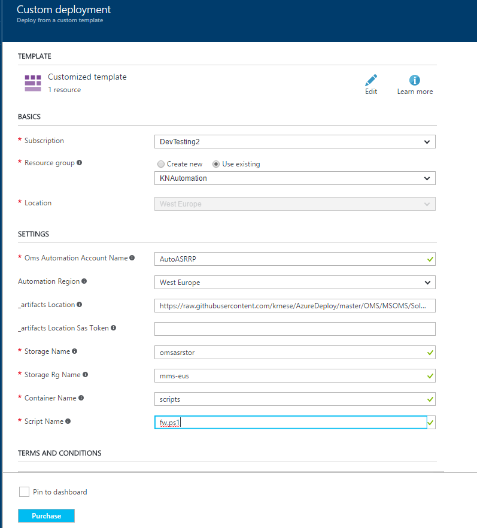
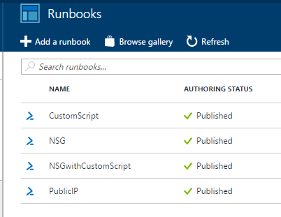
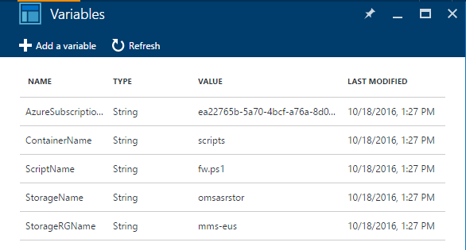
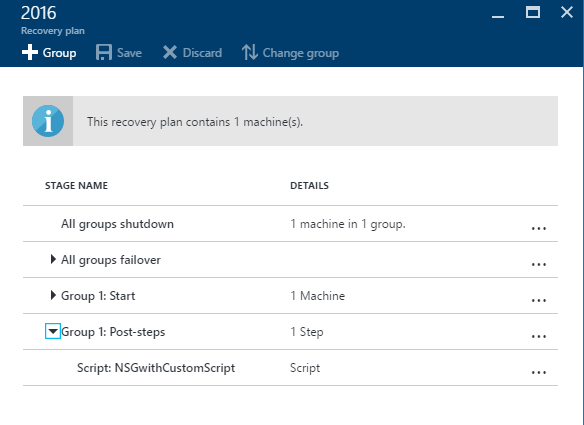
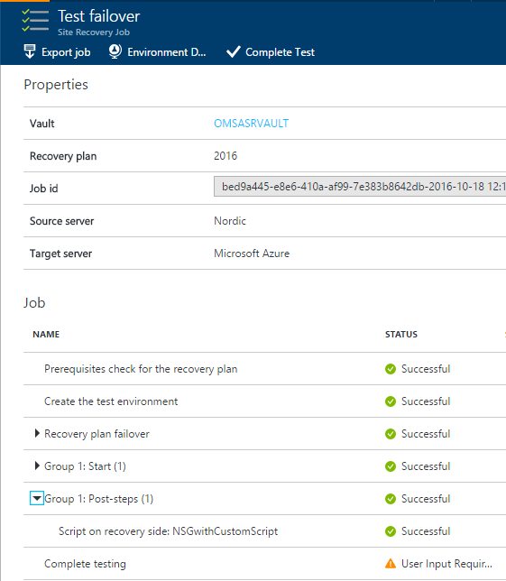
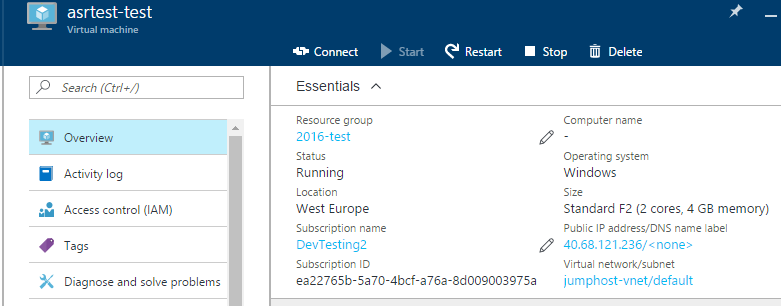
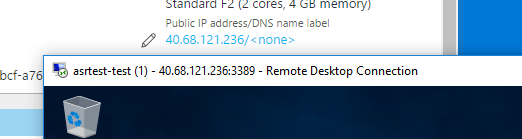

# Azure Site Recovery Automation Runbooks

>This is preliminary documentation for ASR Automation Runbooks and is likely to change in the near future.

These automation runbooks provides the following functionality when doing test, planned and unplanned failover to Azure:

* NSG

The NSG runbook will assign Public IP addresses to every VM within the Recovery Plan and attach their virtual network adapters to a Network Security Group that will allow default communication

* PublicIP

The Public IP runbook will assign Public IP addresses to every VM within the Recovery Plan. Access to the machines and applications will depend on the firewall settings within each guest

* CustomScript

The CustomScript runbook will assign Public IP addresses to every VM within the Recovery Plan and install a custom script extension that will pull the script you refer to during deployment of the template

* NSGwithCustomScript

The NSGwithCustomScript runbook will assign Public IP addresses to every VM within the Recovery Plan, install a custom script using extension and connect the virtual network adapters to a NSG allowing default inbound and outbound communication for remote access

>Note: The runbooks provided are designed to execute across all the VMs within a Recovery Plan in Azure only, as we are iterating thru the VMs within the Resource Group that is being created when failover to Azure. If the failover direction is not Azure, the runbook will be ignored. 
>
> Both *CustomScript* and *NSGwithCustomScript* requires that the Azure VM Agent is present in the guest priort to failover

## Pre-requisites

This template requires an exisitng Azure Automation account with RunAs account, and needs to be created using the Azure portal.

The following PowerShell modules are required if you want to use any of the automation runbooks:

* AzureRm.Profile
* AzureRm.Compute
* Azure.Storage
* AzureRm.Storage
* AzureRm.Resources
* AzureRm.Network

The template will create automation assets that will be used in the runbooks, and if you want to add your custom script to the runbook(s), you need to do the following before deploying the template:

* Create a Storage Account in a Resource Group
* Create a container within the storage account
* Upload your custom script to this container

The template will ask for the names of the Storage Account, its Resource Group, the container name and the name of the script.
Once provided, the template will create variables to reflect this and pull the correct script during runtime. 

Click *Deploy to Azure* below to start the deployment

 

This will take you to the Azure Portal and you need to specify the input parameters as shown below to fit your environment

Once deployed, you should see the following runbooks in your automation account

The following variables are created

You can now use any of these Runbooks together with your Recovery Plan(s).

Go to a Recovery Plan and click 'Customize' and assign the preferred runbook to your group(s) and add it as a Post-Step and click 'Save'

Next, you can run a Test Failover to verify the script is executing as expected

In this example, we added the *NSGwithCustomScript* runbook to the Recovery Plan, and we can successfully connect to the VM since the custom script enabled RDP and opened port 443 in the guest, and the NSG is allowing RDP traffic

