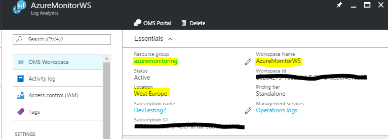
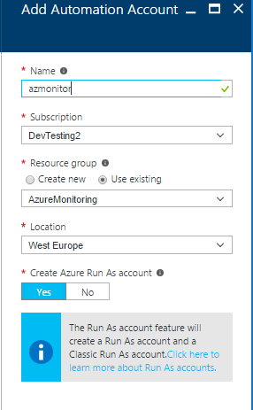
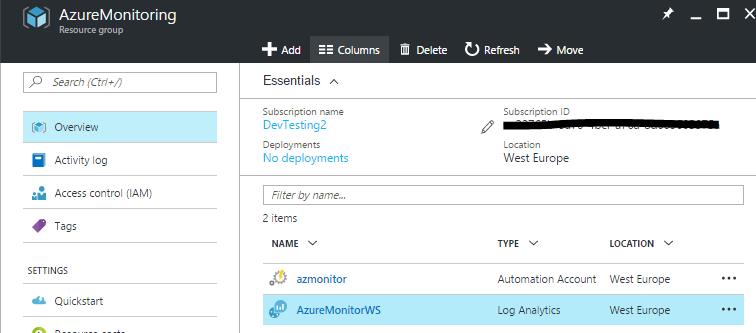
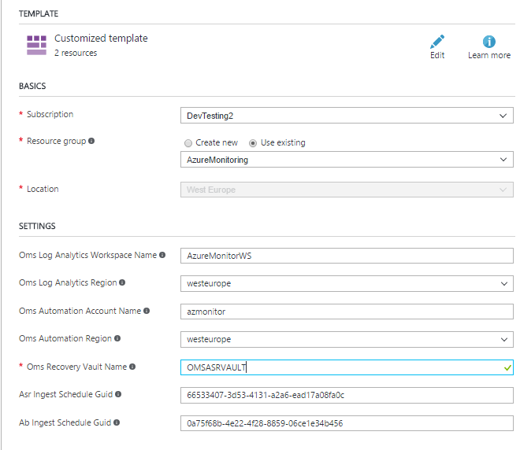
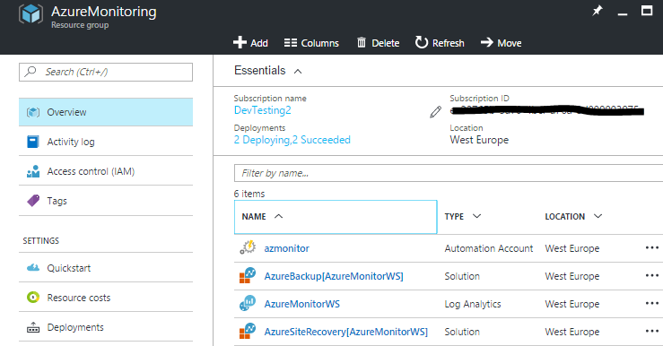
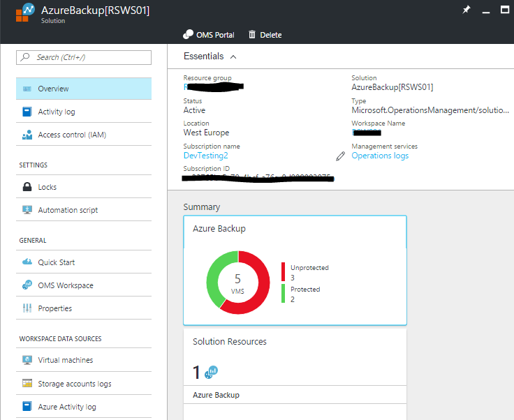
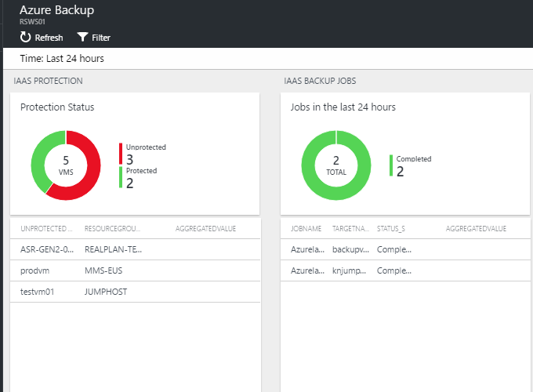
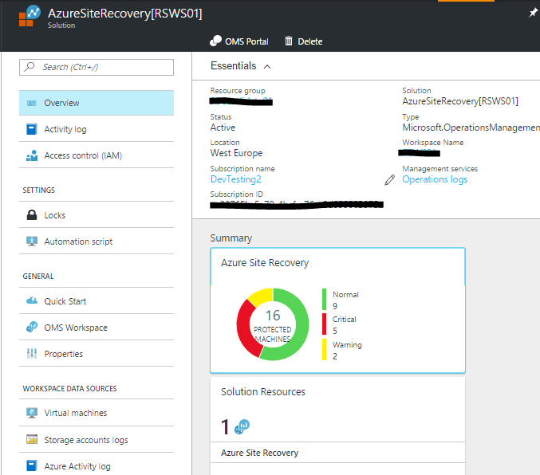
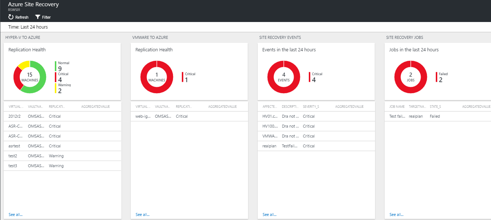

# Azure Recovery Services Analytics

 

>[AZURE.NOTE]This is preliminary documentation for Azure Recovery Services Analytics, a management solution you can deploy into OMS that will provide insights and analytics of your Recovery and Backup vaults. The solution is currently in preview. 

Azure Recovery Services Analytics will monitor your Recovery and Backup Vault in Azure (ARM) and visualize the data in Log Analytics. The data ingestion is currently based on Automation Runbooks that has to be deployed to a dedicated Automation Account.

## Pre-reqs

- **Automation Account with SPN**

Before you deploy this template, you must create an Automation Account in the Azure portal with the default settings so that the SPN account will be created. If you have an existing OMS Log Analytics Workspace you would like to use for this OMS ASR solution, it is important that the Automation account is created into the **same Resource Group where the OMS Log Analytics Workspace is located**.

If you **dont** have an existing OMS Log Analytics Workspace, the template will create and deploy this for you.

## Deploying the Azure Recovery Services Solution

### Follow these instructions to deploy solution into an existing - or new Log Analytics Workspace

Log into Azure Portal (https://portal.azure.com) and ensure you are in the subscription containing the recovery vault you want to monitor

Locate your existing OMS Log Analytics Workspace and note the name of the workspace, the location of the workspace, and the Resource Group

 

Next, create a new Automation Account and click on *New* and search for 'Automation'

 
Select Automation and click *Create* 

Specify the name of the Automation Account and ensure you are selecting 'Use existing' and selects the Resource Group containing the OMS Log Analytics workspace. If possible, use the same Azure Region for the Automation Account. Ensure that 'Create Azure Run As account' is set to 'Yes' and click 'Create'

Once the deployment has completed, you should see the Automation account and the Log Analytics workspace in the same Resource Group

###You can now deploy the template   
  

This will send you to the Azure Portal with some default values for the template parameters. 
Ensure that the parameters reflects your setup so that you are deploying this into the *existing* Resource Group containing the Log Analytics Workspace and the Automation account.

*It is important that you type the exact values for your workspace name and automation account name, and points to the regions where these resources are deployed.* 

You should also change the values for the *Asr Ingest Schedule Guid* and *Ab Ingest Schedule Guid*. You can generate your own using PowerShell with the following cmdlet:

Once you have customized all the parameters, click *Create*

The ingestion will start 5-10 minutes post deployment.

## Exploring the views

Once the template has successfully been deployed, the first data ingestion should occur 6-8 minutes post deployment. If you are deploying the solution to a new workspace, it can take approximately 30 minutes before the indexing has completed for the workspace in general. 

In the Resource Group where you deployed the template, you should see two solution resources.

* AzureBackup[workspaceName]
* AzureSiteRecovery[workspaceName]

### Azure Backup

The views for Azure Backup will give you an overview of all the virtual machines within the region where your vault is deployed, and tell you whether they are protected or unprotected. 

The job view shows the last jobs and their state, so you can ensure that your backup operations are compliant.

### Azure Site Recovery

In the views for Azure Site Recovery, we are currently looking at all your protected VMs, and the supported scenarios in this release is:

* Hyper-V 2 Azure
* VMware/physical 2 Azure

We categorize the VMs based on the scenario(s) you have enabled and will give you a holistic view across all the events and jobs for the recovery vault

