## Microsoft OMS - Demo Instructions

>Latest update: 1/16/2017

>Author: krnese (OMS CAT)

#### Storyline

The demos provided are intended to show the value of OMS services and the focus is entirely around better-together scenarios. 

A **custom dashboard** is made as the entry point to all of the demos and the demos provided below need to be executed in the right order. There’s also some space to go beyond the scope of each demo where the trainer can talk, demo and perform other tasks based on the ask from the attendees/customers.

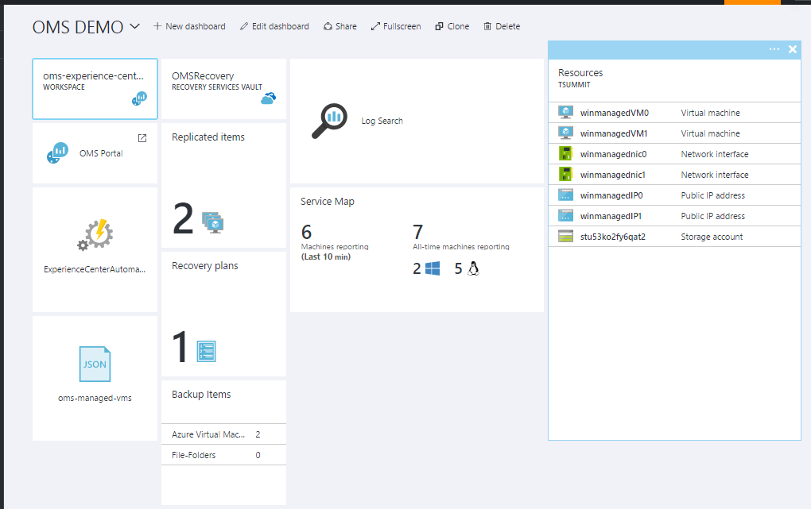

#### Scenario 1 - Enabling Management at Scale using OMS for Azure IaaS

##### Overview

In this demo, you will show how you can deploy a Resource Manager template that will automatically enable management on virtual machines, by installing the OMS VM Extension. In addition, the PowerShell DSC VM Extension will be used to connect with Azure Automation DSC that will apply a configuration to ensure the OMS service is constantly running and is compliant.

##### Key takeaway

OMS is Management as a Service and the entry point from a workload perspective is very easy. This demo will show how customers can plug their resources into several of the OMS services, starting already from the deployment. Although the demo is Azure centric, it is important to point out that any VM running anywhere can be connected to these services, using a similar automated approach.

1. In the Azure portal, click on the **oms-managed-vms** template 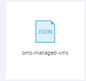
2. Click **Deploy** to see the parameters of the template, and show that the template can be used across platforms (Windows/Linux), can deploy multiple VMs simultaneously and decide whether they should be managed or not 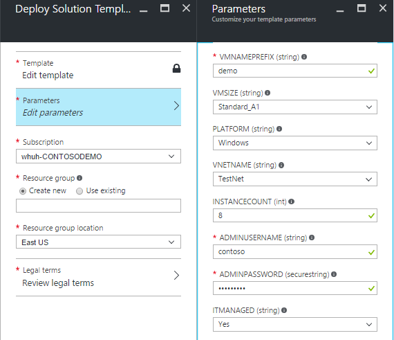
3. Next, close the template and open the **TSUMMIT** resource group from the dashboard
4. Click on **winmanagedVM0** and then click on **Extensions**. This will list all the extensions that are installed using the template and we can see that Log Analytics, Azure Security and Azure Automation is connected. Close the blades once you are done. 
5. Back to the dashboard, click on **ExperienceCenterAutomation** and drill into the **DSC Nodes** blade.
6. Explore one of the machines that are compliant by clicking on the assigned configuration. This will show the reporting of this particular node. Explain how DSC *pull* is working and the settings we can apply to the LCM (Local Configuration Manager)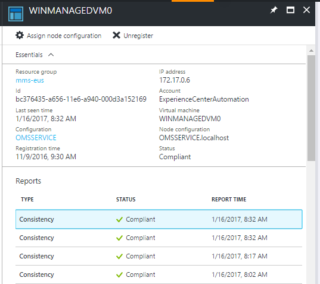
7. Go back to the dashboard and click on **OMS Portal**. This will open the stand-alone OMS portal for the **OMS Experience Center demo**
8. Open **Log Search**, click on **Favorites** and scroll down to find **FIELD DEMO** and click on **Verify Connected VMs**.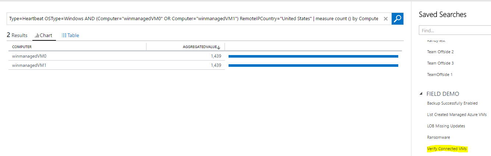

##### Closing

We have now verified that the VMs that were deployed using the Resource Manager template had successfully connected the instances to several OMS services, where the OMS agent is reporting to the Log Analytics workspace and they are managed by Automation DSC

##### Appendix

To expand the demo, use the VMs in the **TSUMMIT2** resource group and add them to the workspace any way you want. This can be done by connecting the VMs to the Log Analytics workspace directly in the Azure portal, and you can also add the VMs to Automation DSC and choose one of the available configurations

#### Scenario 2 - Automated Backup of new Managed VMs

##### Overview

You will show how to leverage **Log Analytics** and the **Azure Activity** solution to capture events of VM creations from Azure, that will generate an alert that triggers a runbook, which will then automatically enable backup and protect the VMs, using **Azure Backup**

##### Key takeaway

With Management as a Service, customers can now focus on what's important - keeping their businesses running instead of managing the management tools. With this approach, they can reduce the footprint significantly within their own on-premises and reduce Time-To-Value. Note that there's no management of storage, tape, databases, patches etc. when using OMS and they can take advantage of new features and capabilities as soon as they are available following the cloud cadence. 

1. In the Azure portal, click on **OMS Portal** and drill into the Azure Activity Log solution. Talk about what we are seeing here, that Log Analytics collects logs from **any** subscription and can query and correlate using the search feature.
2. Go to **Log Search**, click on **Favorites**, and scroll down to **FIELD DEMO**. Run the **List Created Managed Azure VMs** query - based on data coming from the Azure Activity Log. You will have to change the time range for the query, to go back to October to get the results for these particular VMs.  This will list the two managed VMs you showed in the first demo. They are being deployed to Azure and recognized as *Managed VMs*, hence they will qualify for backup 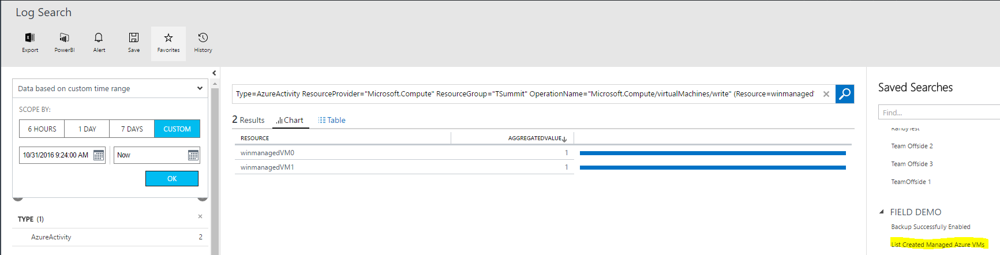
3. Go to **Settings** in the workspace and click on **Alerts**. Click on **edit** on the **Enable-Backup-of-Managed-VMs**. Explain how Log Analytics is passing the search result to a runbook using webhooks, and how the runbooks is designed to iterate through the search results to perform the required actions 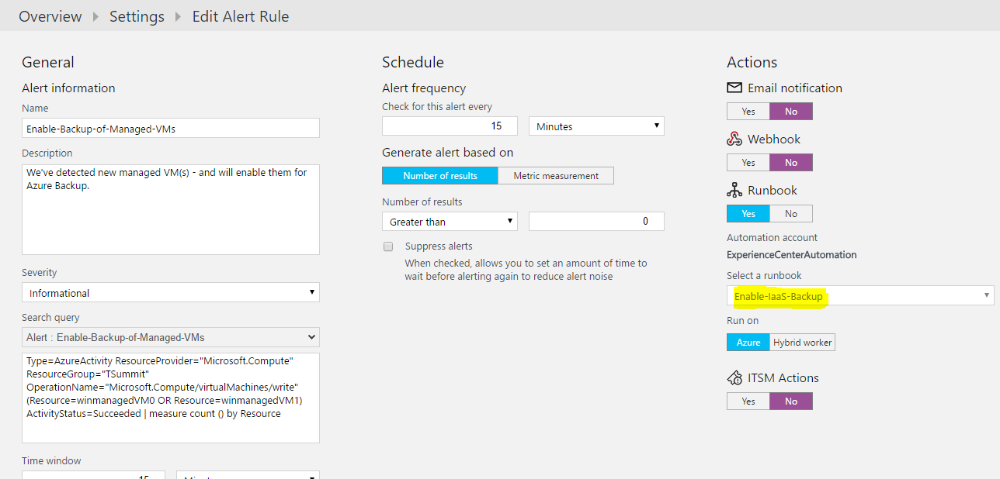
4. Navigate back to the dashboard in Azure portal and click on the **OMSRecovery** recovery vault
5. Open **Backup items** and verify that both VMs are being protected with **Azure Backup** 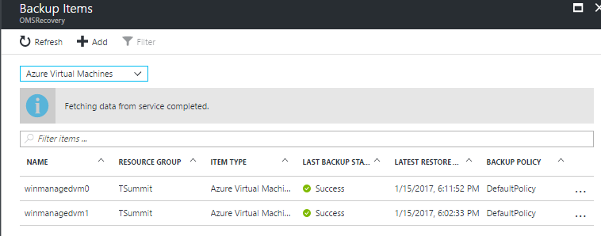
6. Go back to the OMS stand-alone portal, Log Search, and navigate to **FIELD DEMO** and run the **Backup Successfully Enabled** query to show that the backup operation was also captured by Log Analytics. Remember to change the time rang to start on the 30th of October to get the results for these machines 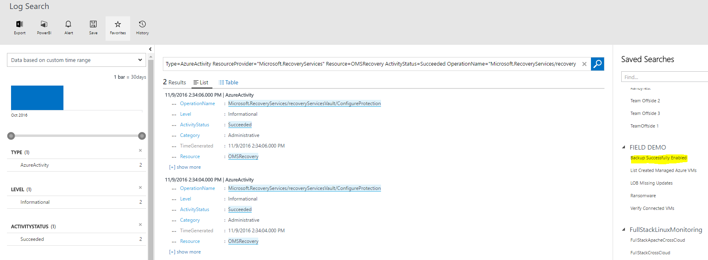

##### Closing

We have explored some of the integration capabilities within OMS where we are using events coming from the Azure platform to automatically take actions on our workloads, using a combination of Log Analytics, Automation and Backup.

##### Appendix

You can further explore the webhooks and the runbook itself in the Automation account, and walk through the construct when using variables, credentials, modules etc. from the asset store, and talk about other common use cases for remediation.

#### Scenario 3 - Recovering from ransomware

##### Overview

This demo will show how customers can do forensics in **Log Analytics** based on the **Security & Audit** solution to track any suspicious activity in the environments. Once detected, you can recovery using **Azure Backup**

##### Key takeaway

Having a holistic view across resources - across clouds is key in the era of cloud computing and management as a service. OMS provides the capabilities to bring visibility into your critical assets - also from a security standpoint. Organizations are now able to become data driven and can not only see what is going on, but also act upon any log and event in **Log Analytics**.

1. In the Azure porta, open the **OMS Portal** and click on the **Security & Audit** solution in the main dashboard. Spend some time to talk about the data we are collecting and the logic behind (this is a result from our learning running hyper scale services and datacenters, and we are putting that learning back into our products so that customers can leverage that for their own needs)
2. Go to Log Search, click on favorites and locate **FIELD DEMO**, where you will execute the **Ransomware** query, which will see if there's any new security groups created on the managed computers. 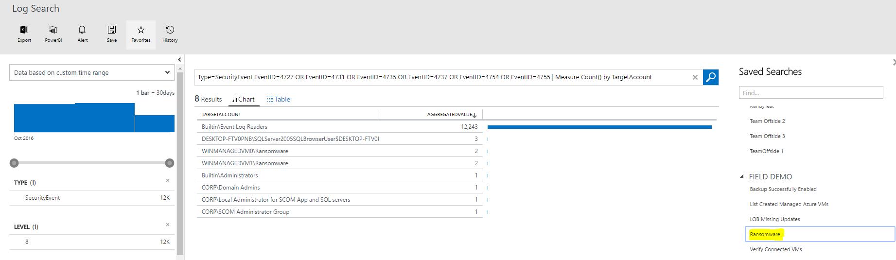
3. Click on **WINMANAGEDVM0\Ransomware** or **WINMANAGEDVM1\Ransomware** to explore the details, which shows that a new security group was created and named as *ransomware*. 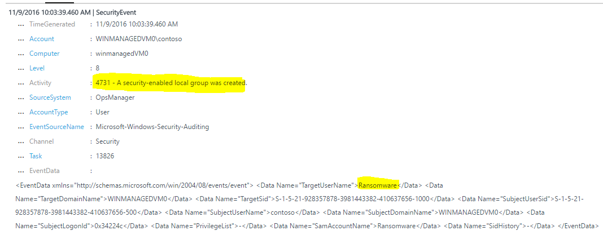
4. Go back to the Azure portal and click on the **OMSRecovery** tile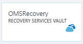
5. Navigate to **Backup items** and select the **winmanagedvm0** machine. Click on **Restore VM** and talk about the options available. **Do not perform a restore** 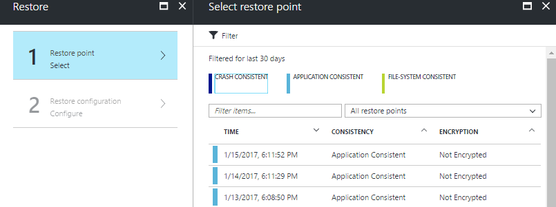

##### Closing

OMS services can be used to monitor and to recover from a security event. In this example we detected ransomware on a machine and used **Azure Backup** to recover to the right point in time, having the option of both application consistent and crash consistent backups.

##### Appendix

Explore the different options we have in Azure Backup for on-prem protection and integration with System Center. Further, explore the different options you have when creating a new backup policy.

#### Scenario 4 - Test Failover + Update Management

##### Overview

During this demo, you will combine **Log Analytics**, **Automation** and **Site Recovery** to solve a very complex task that many customers are facing today. To verify that the Windows Updates are working for your line of business applications, running on-prem, you will use **Site Recovery** to perform a test failover using a recovery plan, which will automatically bring the application online in Azure. Next, you will use the **Update Management** solution in OMS to schedule patches to verify the LOB application is working as expecting, to limit the risk when applying them to production.

##### Key takeaway

Most customers are familiar that testing production is a fact. This is far from ideal but the reality is that it's costly to create *and* maintain a test environment that is truly reflecting the production environment. With management as a service - delivered from a hyperscale cloud, Microsoft are democratizing disaster recovery, migrations, and replication of production workloads, so customers can instantly have a copy of their running production workloads - without affecting production.

1. In the Azure portal, click on the **OMSRecovery** tile
2. Go to **Recovery Plans** and you should see **LOBApp** that is waiting for user input. Click on **waiting for user input**. 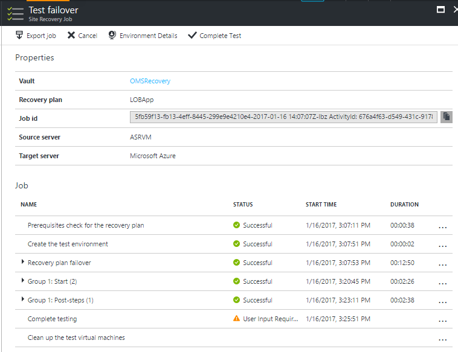
3. Expand **Group1: Post-steps(1)** to show that we use Azure Automation to perform additional steps on the workloads in the recovery plan. The recovery plan has now created a copy of a running production workload in Azure 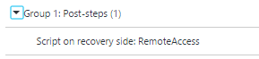
4. Back in the Azure portal, open the **OMS Portal**
5. Open the **Update Management** solution and spend some time on the views, explain its purpose and how customers can use it towards their Windows and Linux servers, across environments and clouds to manage their patches. 
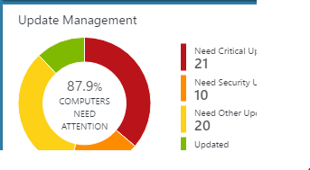
6. Go to **Log Search** and find the saved search **LOB App Missing Security Update** in the **FIELD DEMO** category. You should see at least two results. Explain that these machines are already running in a test environment in Azure, and you will now schedule an **Manage Update Deployments** to verify that the applications are working as expected after testing the updates. 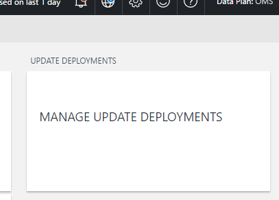
7. Create a new schedule, assign it a name, and find the computer group **FIELD DEMO:LOB VMs**. Ensure the schedule will run only once and click save. 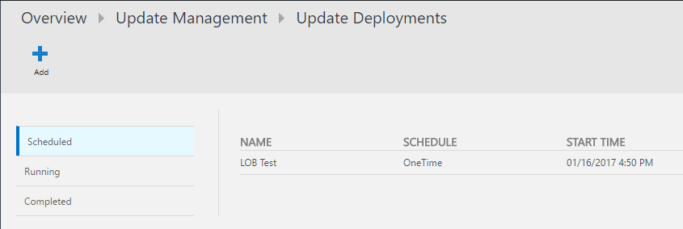
8. Go back to the Azure portal and open the **OMSRecovery** tile and navigate to the recovery plan. 
9. Explain that once the testing is complete, you can simply click **Complete test** (**DO NOT COMPLETE THE TEST :-)**) and the entire test environment will be deleted. The natural next step after the patches are verified is to schedule another update run for the production workload on-prem.

##### Closing

Disaster Recovery and Update Management are known to be both challenging and comprehensive within enterprises organizations today. With OMS and management as a *service*, this just got much easier.

